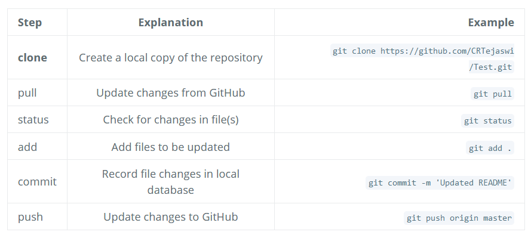

# GitHub Workflow

__Upload local project using Git (to GitHub)__ <br>

- On GitHub, create repo (_eg. port2020_) without any files.
- From Shell:
```
git init
git add .
git commit -m 'message'
git remote add origin https://github.com/CRTejaswi/<REPO>.git
git remote --verbose
git push origin master
```

__Common Tasks__ <br>



__Common Issues__ <br>

- Exclude certain files/folders: <br>
    Include filenames in a `.gitignore` file (in root of repository). <br>
- Remove files you have added by mistake: <br>
    This does not affect the file on your PC. <br>
    ```
    git reset README.html
    ```
<!-- - Undo changes you have made to your files since last commit: <br>
    This affects the files on your PC. <br>
    ```

    ```
 -->
- Lookup previous changes (commits): <br>
    ```
    git log
    git log --pretty=oneline
    ```
<!-- - You may need to update the url of your GitHub repo. Update current remote url using: <br>
    ```
    git remote set-url origin https://github.com/CRTejaswi/<REPO>.git
    ``` -->

__Working In A Group__ <br>

- __Create your own copy of a project__ <br>
    This is called FORK on Github. <br>

- __Remote v Branch__ <br>
    `remote` refers to the url of the remote copy of the project. <br>
    eg. `origin` is an alias for the main url of your project. <br>
    `branch` refers to parallel "branches" of the same project. <br>
    These are used to work on specific tasks apart from the main workflow. <br>
    To check all remotes/branches for current project, use: <br>
    ```
    git remote
    git branch
    ```
    This is how a complete PUSH command looks like. If you leave out remote/branch (`git push`), the current values are used: <br>
    ```
    git push <remote> <branch>
    git push origin master
    git push origin feature
    ```

- __Feature Branches__ <br>
    - Switch between feature branches: <br>
        ```
        git branch                      <- List all available feature branches.
        git checkout -b <new_branch>    <- Create a new branch, then switch to it.
        git checkout <existing_branch>  <- Switch to an existing branch.
        git checkout master             <- Switch to main workflow (master branch)
        ```
    - Add completed features to main workflow: <br>
        ```
        git checkout master
        git merge --squash <BRANCH>
        ```
    - Delete a branch locally/remotely: <br>
        ```
        git branch -D <BRANCH>
        git push origin --delete <BRANCH>
        ```

- __Make changes to main project__ <br>
    Submit a PULL Request on Github. <br>
    Pull requests cannot be deleted from project history. So, ensure that you give concise info at each stage so there's less clutter in the discussion. <br>
